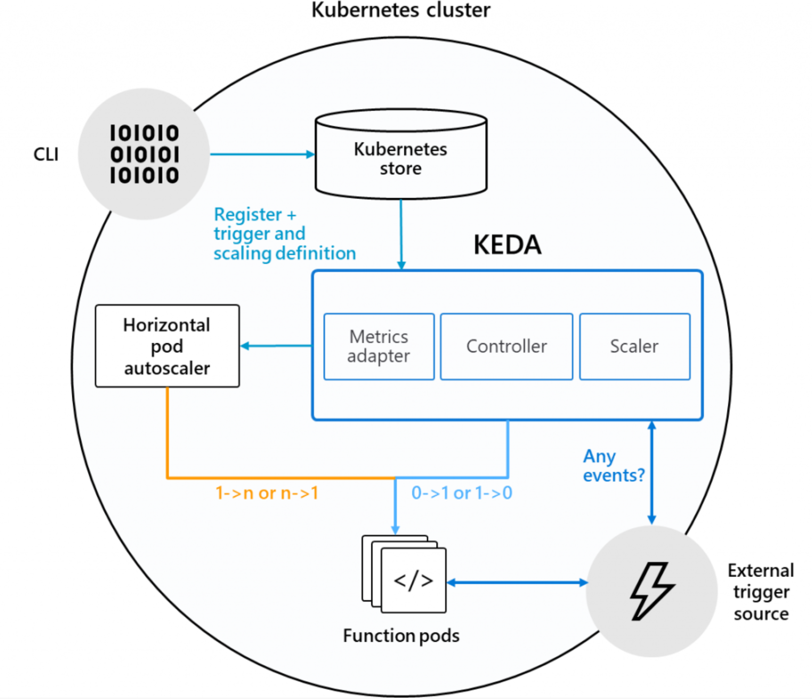
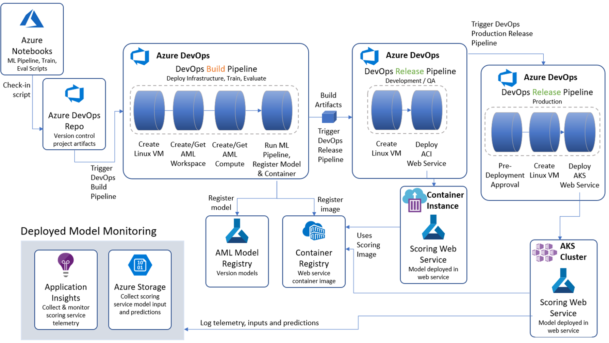

# Serverless AKS Demos
This repostitory recap Serverless demo around AKS and Microsoft Azure. AKS cluster combine Virtual Kubelet ( ACI ) and KEDA as well as message sender.

## Demo 1 : Virtual Kubelet ( ACI )

## Demo 2 : KEDA

## Demo 3 : DataOps

## Azure Kubernetes services ( AKS ) useful references : 

- AKS Current preview features: https://aka.ms/aks/previewfeatures
- AKS Release notes: https://aka.ms/aks/releasenotes
- AKS Public roadmap: http://aka.ms/aks/roadmap
- AKS Known-issues: https://aka.ms/aks/knownissues

## More details on my blog & other Github repos : 

Please go to my blog cloud-melon.com to get more details about how to implement this solution and more about Microsoft Azure ( ref link : https://cloud-melon.com )

Feel free to reach out to my twitter **@MelonyQ** for more details ( https://twitter.com/MelonyQ ). 

Find wrap-ups of some useful bash commands here : 
[cloudmelon's bash playbook ](https://github.com/cloudmelon/melonbash)

Find wrap-ups of some useful git commands here : 
[cloudmelon's git playbook ](https://github.com/cloudmelon/melongit)
